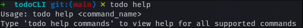

# todo_cli

## Contents

1. [Installation](#installation)
2. [Usage](#usage)
3. [Commands](#commands)

## Description

This is a basic CLI program designed for creating `todo.md` files and making them interactive through the command line.
This is done through a new bash alias `todo` which allows for new commands to manage tasks in the `todo.md` file.
For a list of supported commands view the [Commands](#Commands) chapter.

## Installation

<span style="color:green">This is still to be determined</span>.

## Usage

The core usage of the `todo_cli` program after installation is performed through command-line inputs prefixed with the alias `todo`. An example of this is:

```bash
todo help
```

This command will display the usage guidelines for the program: 

## Commands

```
Command - Description

todo help - Shows the usage of the help command.
todo help commands - Shows a list of all the commands.
todo createList - Creates a new todo.md unless one exists.
todo list - Displays all the current lines in the todo.md.
todo deletelist - Deletes the current todo.md.
todo add <text> - Adds the inputted <text> as a new line in todo.md.
todo del <entry_num> - Deletes the line at line number <entry_num> from todo.md.
```
